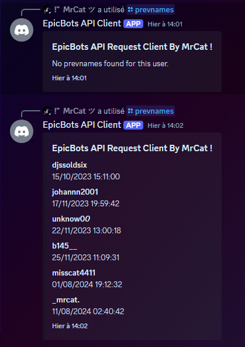

[](https://www.javascript.com/)
[](https://github.com/)

<br />
<p align="center">

  <h3 align="center">EpicBot API Client</h3>

  <p align="center">
    <br />
    <a href="https://github.com/bipre2466/EpicBots-API-Client-V1/issues">Report BUG</a>
    ·
    <a href="https://github.com/bipre2466/EpicBots-API-Client-V1/issues">Request Function</a>
  </p>
</p>
<br />
<br />

## Made With
<!-- MADE WITH-->
* [NodeJS](https://nodejs.org/en/)
* [epicbots-prevnames](https://www.npmjs.com/package/epicbots-prevnames)
<br />

## Installation

1. Clone repo
   ```sh
   git clone https://github.com/bipre2466/EpicBots-API-Client.git
   ```
2. Install dependancies
   ```sh
   npm i
   ```
3. Complete the configuration
4. Start Bot
   ```sh
   node index.js
   ```
<br />
<br />

<!-- ROADMAP 
## Feuille de route

Voir les [issues](https://github.com/bipre2466/EpicBots-API-Client-V1) pour une liste des fonctionnalités proposées (et des problèmes connus).
<br />
<br />
<br />-->

<!-- CONTRIBUTING -->
## Contributing

Any contribution you make is **greatly appreciated**.

<!--1. Fork le projet
2. Créez votre branche (`git checkout -b feature/AmazingFeature`)
3. Validez vos modifications (`git commit -m 'Add some AmazingFeature'`)
4. Pousser votre branche (`git push origin feature/AmazingFeature`)
5. Ouvrir une Pull Request-->
<br />

<!-- LICENSE -->
## License

Distributed under the Apache 2.0 license. See 'LICENSE' for more information.
<br />
<br />

<!-- CONTACT -->
## Contact

MrCat ツ - [@Misscat4411](https://github.com/Bipre2466) - cloudmrcat@gmail.com

Link of the project: [https://github.com/bipre2466/EpicBots-API-Client-V1](https://github.com/bipre2466/EpicBots-API-Client-V1)

<!-- DISCORD -->
## Discord

MrCat ツ : justmrcat

## Prewiew
 
